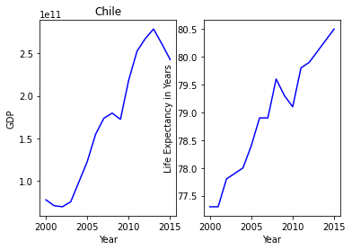
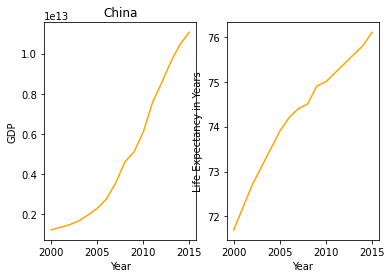
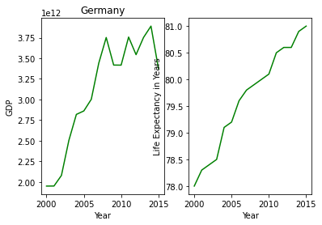
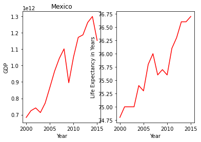
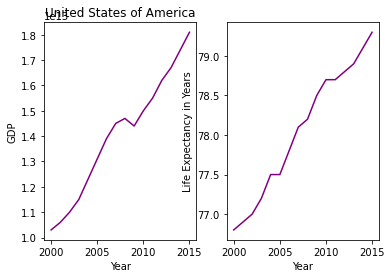
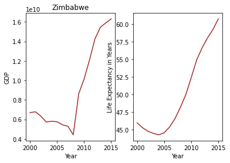

# GDP and Life Expectancy Project

This project aimed to answer several questions regarding GDP and life expectancy in six nations between 2000 and 2015 (Chile, China, Germany, Mexico, the USA, and Zimbabwe).

First, has life expectancy increased over time in these nations? The answer is that yes, life expectancy has increased over time in each of the six nations, although not at the same rate.

Next, has GDP increased during the same period? And again, the answer is yes. Each country experienced growth in its GDP over this 15-year period.

Then, is there a correlation between GDP and life expectancy in a country? We calculated a correlation of almost one in each instance, meaning there is a strong positive correlation. That shows up in these images.  

Finally, what is the average life expectancy in these countries? In Chile, the average life expectancy is 78.94. The average life expectancy in China is 74.26. In Germany, we find an average of 79.66, the highest of the six nations. Mexico's life expectancy comes in at 75.72. The USA has an average of 78.08. The lowest life expectancy is in Zimbabwe at 50.09.

The process of finding these statistics was informative. While I expected to find a correlation between GDP and life expectancy, I didn't know that it would be quite that strong. Also, I had no idea there was such a large gap in average life expectancy from developing nations to developed countries.
